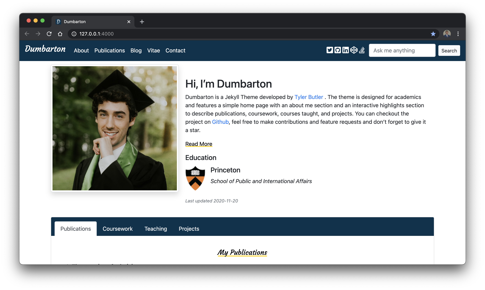

# Dumbarton
[](https://app.netlify.com/sites/admiring-bassi-e955ad/deploys)
  
A Jekyll theme designed for academics, powered by Bootstrap 4. [Demo](https://dumbarton.netlify.app/) page hosted on Netlify.





## Installation   

Follow the following instructions to install the Dumbarton theme

1) Download the source code 

```bash
git clone https://github.com/tcbutler320/dumbarton.git
```

2) cd into the folder 

```bash
cd dumbarton
```

3) Use bundler to install dependancies

```bash
bundle install
```

4) Start the Jekyll development server

```bash
bundle exec jekyll serve
```

## Development Roadmap 


+ [x] Jekyll Scholar publication formatting
+ [ ] Include more [Awesome Jekyll Plug ins](https://github.com/planetjekyll/awesome-jekyll-plugins)
+ [ ] Create custom CSS for jekyll-scholar formatting
+ [ ] Add [Jekyll-Admin](https://github.com/jekyll/jekyll-admin) for CMS 

## Style 

**Bootstrap CDN**

**Fontawesome** 

## Academic Options 

### Jekyll Scholar 
*Excerpt from [Jekyll-Scholar](https://github.com/inukshuk/jekyll-scholar)*
> Jekyll-Scholar is for all the academic bloggers out there. It is a set of extensions to Jekyll, the awesome, blog aware, static site generator; it formats your bibliographies and reading lists for the web and gives your blog posts citation super-powers.  


## Theme Options 

## Blog Settings 

### Blog Page Settings   

The main blog page uses Bootstrap 4 Cards to preview individual blog posts. There are several different types of preview styles available. Set the preview by changing the frontmatter on the post *.md file in the `_posts` directory. The current available options are below.  

|   Option       |   Syntax       |  Description       |   Preview  |
|----------------|----------------|--------------------|------------|
| card-img-top  | `card-img-top`  |  Image on top      |            |
| card-dated    | `card-dated`    |  Shows Date        |            |
| card-no-img   | `card-no-img`   |  No Header Image   |            |


### Favicon 

Site favicons are located at `/assets/img/icons`. You can use a [Favicon Generator](https://realfavicongenerator.net/) to create a new set of icons using any image you'd like. Simply create a package from the aboved linked generator and replace the icons folder. 

### Meta Data 

For more information about editing the metadata used in `header.html` can be found on [htmlhead.dev](https://htmlhead.dev/)


### Media

Sample images used in the Dumbarton Demo site were found on [unsplash](https://unsplash.com/)